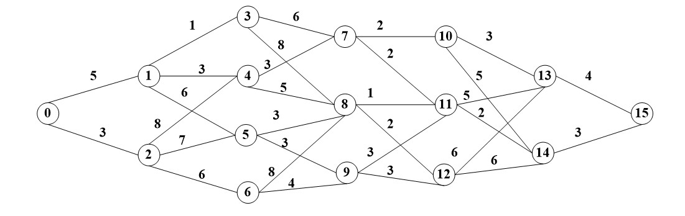

# Practice 2

## 1

> **Matrix-chain product** . The following are some instances.

**矩阵链乘积** 。以下是一些例子。

1. <3, 5, 2, 1, 10>
2. <2, 7, 3, 6, 10>
3. <10, 3, 15, 12, 7, 2>
4. <7, 2, 4, 15, 20, 5>

## 2

> **Longest Common Subsequence** (LCS). The following are some instance.

**最长公共子序列** （LCS）。以下是一些例子。

1. X: xzyzzyx  Y: zxyyzxz
2. X: MAEEEVAKLEKHLMLLRQEYVKLQKKLAETEKRCALLAAQANKESSSESFISRLLAIVAD  Y: MAEEEVAKLEKHLMLLRQEYVKLQKKLAETEKRCTLLAAQANKENSNESFISRLLAIVAG

## 3

> **Longest Common Substring** . The following are some instances.

**最长公共子串** 。以下是一些例子。

1. X: xzyzzyx  Y: zxyyzxz
2. X: MAEEEVAKLEKHLMLLRQEYVKLQKKLAETEKRCALLAAQANKESSSESFISRLLAIVAD  Y: MAEEEVAKLEKHLMLLRQEYVKLQKKLAETEKRCTLLAAQANKENSNESFISRLLAIVAG

## 4

> Max Sum. The following is an instance.

**最大和** 。以下是一个例子。

1. (-2, 11, -4, 13, -5, -2)

## 5

> Shortest path in multistage graphs. Find the shortest path from 0 to 15 for the following graph.
> 
> A multistage graph is graph(1)G=(V,E) with V partitioned into K >= 2 disjoint subsets such that if (a,b) is in E, then a is in Vi, and b is in Vi+1 for some subsets in the partition; and(2) |V1| = |Vk| = 1.

多级图中的最短路径。找出下图中从节点0到节点15的最短路径。

多级图是满足以下条件的图

1. G = (V, E) 的 V 可以被分为 K >= 2 个不相交的部分，并且对于 E 中的任意一个边 (a, b) ，如果 a 在 Vi 中，则 b 在 Vi+1 中
2. |V1| = |Vk| = 1 

